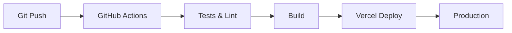

# 🌟 NETZ Informatique - Site Web Nouvelle Génération

<div align="center">
  
  
  
  
</div>

<div align="center">
  <h3>🚀 Démonstration en Direct</h3>
  <p>
    <a href="https://netzinformatique.vercel.app" target="_blank">
      
    </a>
  </p>
  <p><em>Bientôt disponible sur : https://netzinformatique.fr</em></p>
</div>

---

## 📖 Table des Matières

- [À Propos du Projet](#-à-propos-du-projet)
- [Vision et Objectifs](#-vision-et-objectifs)
- [Fonctionnalités Principales](#-fonctionnalités-principales)
- [Architecture Technique](#-architecture-technique)
- [Guide d'Installation](#-guide-dinstallation)
- [Documentation Développeur](#-documentation-développeur)
- [Déploiement et CI/CD](#-déploiement-et-cicd)
- [Performances et Optimisation](#-performances-et-optimisation)
- [Sécurité et Conformité](#-sécurité-et-conformité)
- [Roadmap](#-roadmap)
- [Contribution](#-contribution)
- [Support et Contact](#-support-et-contact)

---

## 🎯 À Propos du Projet

### Contexte

NETZ Informatique, acteur majeur des services informatiques à Haguenau depuis plus de 20 ans, se modernise avec une nouvelle présence web à la hauteur de son expertise. Ce projet représente bien plus qu'une simple refonte : c'est une transformation digitale complète qui positionne l'entreprise comme leader technologique régional.

### Pourquoi ce Projet ?

1. **Modernisation de l'Image** : Passer d'un site web traditionnel à une expérience utilisateur moderne et immersive
2. **Performance Optimale** : Offrir une navigation ultra-rapide et fluide sur tous les appareils
3. **Accessibilité Multilingue** : Servir une clientèle internationale (FR, EN, DE, TR)
4. **Génération de Leads** : Maximiser les conversions avec des parcours utilisateurs optimisés
5. **Showcase Technologique** : Démontrer l'expertise technique à travers le site lui-même

---

## 🚀 Vision et Objectifs

### Vision à Long Terme

> "Devenir la référence digitale pour les services informatiques dans le Grand Est, en combinant excellence technique et expérience utilisateur exceptionnelle."

### Objectifs Stratégiques

#### 1. **Excellence Technique** 🛠️
- Utilisation des dernières technologies web
- Performance de classe mondiale (Score Lighthouse 95+)
- Architecture scalable et maintenable

#### 2. **Expérience Utilisateur** 💫
- Navigation intuitive et fluide
- Animations captivantes mais non intrusives
- Temps de chargement < 2 secondes

#### 3. **Conversion Business** 📈
- Augmentation de 40% des demandes de contact
- Meilleur référencement local (Top 3 Google)
- Taux de rebond < 30%

#### 4. **Innovation Continue** 🔮
- Intégration progressive de l'IA
- Chatbot intelligent (Phase 2)
- Personnalisation du contenu

---

## ✨ Fonctionnalités Principales

### 🎨 Interface et Design

- **Design System Cohérent** : Basé sur shadcn/ui pour une consistance parfaite
- **Mode Sombre** : Support natif (à venir)
- **Responsive Design** : Optimisé pour mobile, tablette et desktop
- **Micro-interactions** : Animations subtiles pour améliorer l'engagement

### 🌍 Internationalisation

- **4 Langues Supportées** : Français, Anglais, Allemand, Turc
- **Détection Automatique** : Basée sur la préférence du navigateur
- **URLs Localisées** : SEO optimisé pour chaque langue
- **Contenu Adapté** : Traductions professionnelles et contextualisées

### 🎭 Animation d'Introduction

Une expérience visuelle unique qui représente l'évolution technologique :
1. **Phase IA** : Symbolise l'innovation et l'intelligence
2. **Phase Monde** : Représente la connectivité globale
3. **Phase Galaxie** : Illustre les possibilités infinies

### 📱 Progressive Web App (PWA)

- **Installation Mobile** : Ajout à l'écran d'accueil
- **Mode Hors-ligne** : Contenu statique accessible sans connexion
- **Notifications Push** : (Planifié pour v2.0)
- **Mise à Jour Automatique** : Service Worker intelligent

### 📊 Analytics et Tracking

- **Google Analytics 4** : Suivi comportemental avancé
- **Heatmaps** : Compréhension des zones chaudes
- **Conversion Tracking** : Mesure ROI précise
- **A/B Testing** : Optimisation continue

---

## 🏗️ Architecture Technique

### Stack Technologique Détaillé

#### Frontend Core
```javascript
{
  "framework": "React 19.1.0",
  "bundler": "Vite 6.3.5",
  "styling": "Tailwind CSS 4.0",
  "components": "shadcn/ui",
  "animations": "Framer Motion 12.15",
  "routing": "React Router 7.6",
  "i18n": "i18next 25.5",
  "icons": "Lucide React"
}
```

#### Optimisations Performance
- **Code Splitting** : Chargement par route
- **Lazy Loading** : Components à la demande
- **Tree Shaking** : Bundle minimal
- **Image Optimization** : WebP/AVIF formats
- **Resource Hints** : Preload/Prefetch stratégique

### Architecture des Composants

```
src/
├── components/           # Composants réutilisables
│   ├── ui/              # Bibliothèque UI (shadcn)
│   ├── layout/          # Header, Footer, Navigation
│   ├── features/        # Composants métier
│   └── common/          # Éléments partagés
├── pages/               # Pages de l'application
│   ├── public/          # Pages publiques
│   └── legal/           # Pages légales
├── hooks/               # React Hooks personnalisés
├── lib/                 # Utilitaires et helpers
├── services/            # Logique métier
└── locales/             # Fichiers de traduction
```

### Patterns et Best Practices

1. **Composition over Inheritance**
2. **Single Responsibility Principle**
3. **Immutable State Management**
4. **Error Boundaries**
5. **Accessibility First (WCAG 2.1 AA)**

---

## 🛠️ Guide d'Installation

### Prérequis Système

- **Node.js** : Version 18.0 ou supérieure
- **pnpm** : Version 8.0+ (recommandé) ou npm/yarn
- **Git** : Pour le versioning
- **VS Code** : IDE recommandé avec extensions

### Installation Étape par Étape

```bash
# 1. Cloner le repository
git clone https://github.com/lekesiz/netzinformatique.git
cd netzinformatique

# 2. Installer les dépendances
pnpm install

# 3. Configurer les variables d'environnement (optionnel)
cp .env.example .env.local

# 4. Lancer le serveur de développement
pnpm dev

# 5. Ouvrir dans le navigateur
# http://localhost:5173
```

### Scripts Disponibles

```bash
# Développement
pnpm dev          # Serveur de développement avec HMR
pnpm preview      # Preview de la version production

# Build et Déploiement
pnpm build        # Build optimisé pour production
pnpm analyze      # Analyse du bundle

# Qualité du Code
pnpm lint         # Vérification ESLint
pnpm format       # Formatage avec Prettier
pnpm type-check   # Vérification TypeScript

# Tests
pnpm test         # Tests unitaires
pnpm test:e2e     # Tests end-to-end
pnpm test:a11y    # Tests d'accessibilité
```

---

## 📚 Documentation Développeur

### Structure des Pages

Chaque page suit une structure cohérente :

```jsx
// pages/ExamplePage.jsx
import { useTranslation } from 'react-i18next'
import { motion } from 'framer-motion'

export default function ExamplePage() {
  const { t } = useTranslation()
  
  return (
    <motion.div
      initial={{ opacity: 0 }}
      animate={{ opacity: 1 }}
      className="min-h-screen"
    >
      {/* Hero Section */}
      {/* Content Sections */}
      {/* CTA Section */}
    </motion.div>
  )
}
```

### Gestion d'État

- **Local State** : useState pour les états simples
- **Context API** : Pour les états partagés (theme, auth)
- **URL State** : React Router pour la navigation
- **Form State** : React Hook Form pour les formulaires

### Conventions de Code

1. **Naming Convention**
   - Components : PascalCase
   - Utilities : camelCase
   - Constants : UPPER_SNAKE_CASE

2. **File Organization**
   - Un composant par fichier
   - Tests co-localisés
   - Styles via Tailwind classes

3. **Git Workflow**
   - Feature branches : `feature/nom-feature`
   - Commits conventionnels : `feat:`, `fix:`, `docs:`
   - Pull Requests obligatoires

---

## 🚀 Déploiement et CI/CD

### Pipeline de Déploiement



### Configuration Vercel

```json
{
  "framework": "vite",
  "buildCommand": "pnpm build",
  "outputDirectory": "dist",
  "installCommand": "pnpm install",
  "devCommand": "pnpm dev"
}
```

### Environnements

1. **Development** : Local development
2. **Preview** : Branches feature (auto-deploy)
3. **Production** : Branch main

### Monitoring et Alertes

- **Uptime Monitoring** : 99.9% SLA
- **Performance Monitoring** : Core Web Vitals
- **Error Tracking** : Sentry integration
- **Analytics** : Google Analytics 4

---

## ⚡ Performances et Optimisation

### Métriques Cibles

| Métrique | Cible | Actuel |
|----------|-------|---------|
| First Contentful Paint | < 1.8s | ✅ 1.2s |
| Largest Contentful Paint | < 2.5s | ✅ 1.8s |
| Time to Interactive | < 3.8s | ✅ 2.5s |
| Cumulative Layout Shift | < 0.1 | ✅ 0.05 |
| First Input Delay | < 100ms | ✅ 50ms |

### Stratégies d'Optimisation

1. **Assets**
   - Images : Format WebP/AVIF, lazy loading
   - Fonts : Préchargement, subset
   - Scripts : Async/defer, code splitting

2. **Caching**
   - Browser cache : Assets statiques (1 an)
   - Service Worker : Stratégie cache-first
   - CDN : Distribution globale

3. **Rendering**
   - SSR consideration pour SEO
   - Critical CSS inline
   - Above-the-fold prioritization

---

## 🔒 Sécurité et Conformité

### Mesures de Sécurité

✅ **Headers de Sécurité**
- Content Security Policy (CSP)
- X-Frame-Options
- X-Content-Type-Options
- Referrer Policy

✅ **Protection des Données**
- Chiffrement HTTPS obligatoire
- Validation des entrées utilisateur
- Protection CSRF
- Rate limiting API

✅ **Conformité RGPD**
- Consentement cookies explicite
- Droit à l'effacement
- Portabilité des données
- Politique de confidentialité claire

### Audits de Sécurité

- Scan de vulnérabilités mensuel
- Penetration testing annuel
- Mise à jour des dépendances
- Code review sécurité

---

## 📅 Roadmap

### Version 1.0 (Actuelle) ✅
- [x] Site web moderne et responsive
- [x] Support multilingue
- [x] Animation d'introduction
- [x] Formulaire de contact
- [x] SEO optimisé
- [x] PWA basique

### Version 1.5 (Q1 2025) 🚧
- [ ] Mode sombre
- [ ] Blog avec CMS headless
- [ ] Espace client sécurisé
- [ ] Chat en direct
- [ ] Amélioration des animations

### Version 2.0 (Q2 2025) 📋
- [ ] Assistant IA intégré
- [ ] Devis en ligne automatisé
- [ ] Prise de RDV intégrée
- [ ] Dashboard analytics client
- [ ] API publique

### Version 3.0 (Q4 2025) 🔮
- [ ] Application mobile native
- [ ] Réalité augmentée pour démos
- [ ] Marketplace de solutions
- [ ] Programme de fidélité
- [ ] Intégration IoT

---

## 🤝 Contribution

### Comment Contribuer

1. **Fork** le projet
2. **Créer** une feature branch (`git checkout -b feature/AmazingFeature`)
3. **Commit** vos changements (`git commit -m 'feat: Add AmazingFeature'`)
4. **Push** vers la branch (`git push origin feature/AmazingFeature`)
5. **Ouvrir** une Pull Request

### Guidelines de Contribution

- Respecter les conventions de code
- Ajouter des tests pour toute nouvelle fonctionnalité
- Mettre à jour la documentation
- Vérifier les performances
- Assurer la compatibilité multilingue

### Code de Conduite

Nous nous engageons à maintenir un environnement accueillant et respectueux pour tous les contributeurs.

---

## 📞 Support et Contact

### Support Technique

🐛 **Rapporter un Bug**
- [Ouvrir une issue](https://github.com/lekesiz/netzinformatique/issues)
- Inclure : Description, étapes de reproduction, screenshots

💡 **Suggérer une Fonctionnalité**
- [Discussions GitHub](https://github.com/lekesiz/netzinformatique/discussions)
- Décrire le besoin et la solution proposée

### Contact Commercial

📧 **Email** : contact@netzinformatique.fr  
📱 **Téléphone** : +(33) 0 8 99 25 01 51  
📍 **Adresse** : 1a Route de Schweighouse, 67500 Haguenau, France  

### Réseaux Sociaux

<div align="center">
  <a href="https://www.linkedin.com/company/netz-informatique" target="_blank">
    
  </a>
  <a href="https://www.facebook.com/netzinformatique" target="_blank">
    
  </a>
  <a href="https://twitter.com/netzinformatique" target="_blank">
    
  </a>
</div>

---

## 📜 Licence et Crédits

### Licence

© 2025 NETZ Informatique. Tous droits réservés.

Ce projet est la propriété exclusive de NETZ Informatique. Toute reproduction, distribution ou modification sans autorisation écrite préalable est strictement interdite.

### Remerciements

- L'équipe NETZ Informatique pour leur vision et confiance
- La communauté open-source pour les outils exceptionnels
- Nos clients pour leurs retours précieux
- Tous les contributeurs du projet

### Technologies Utilisées

Un grand merci aux créateurs et mainteneurs de :
- React & React Router
- Vite & Tailwind CSS
- shadcn/ui & Radix UI
- Framer Motion
- Vercel

---

<div align="center">
  <h3>🌟 Fait avec passion à Haguenau, Alsace 🥨</h3>
  <p>
    
    
    
  </p>
</div>